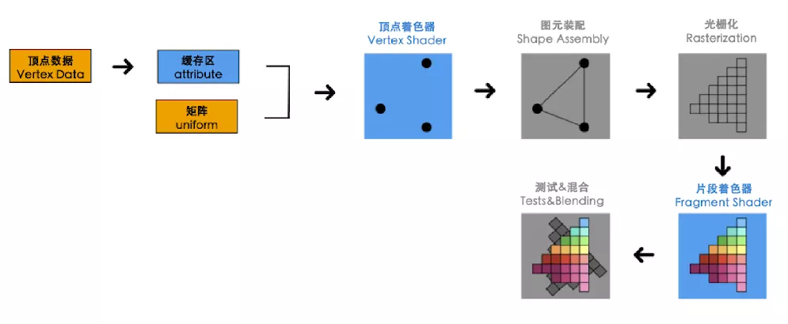
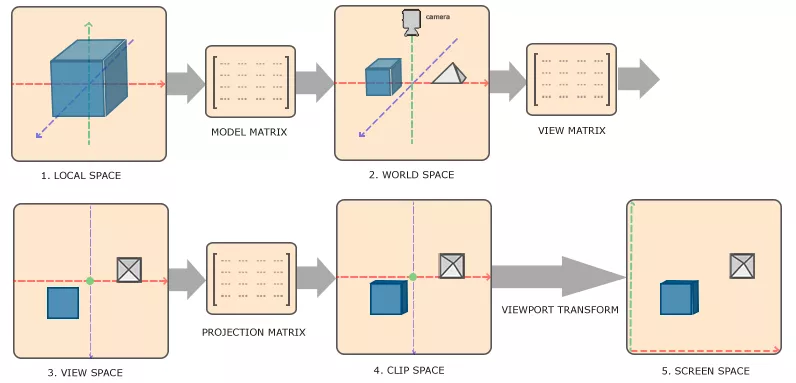
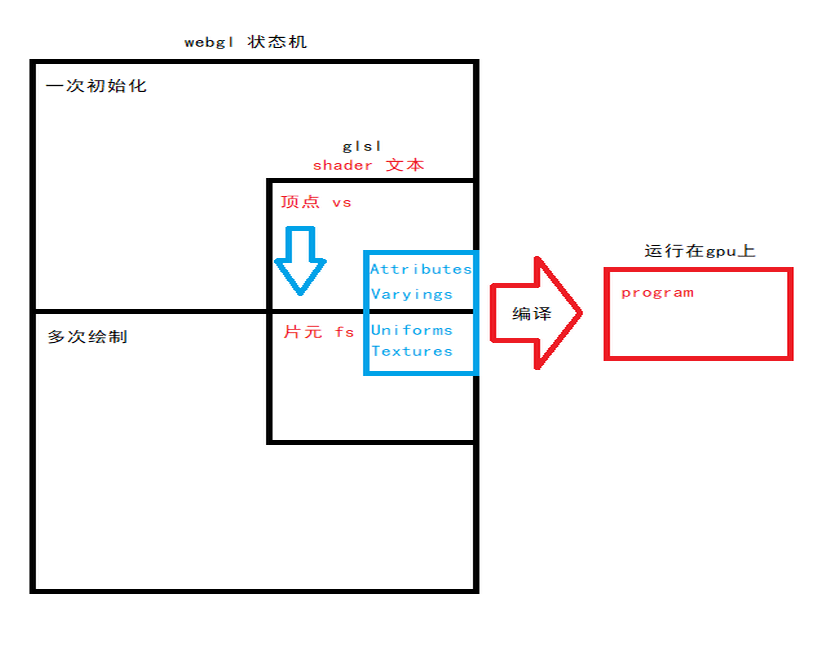

# Shader编程入门

## 一、背景&介绍

当在工作中需要实现某些效果，搜寻答案时告知shader可解；于是找到一些shader实现，但直面shader难免疑惑，
（为什么看着有好几种变量声明；这看着是个普通变量，又是从哪里来的；数据是怎么从顶点着色器传到片元着色器等）
本次分享会介绍必要概念，尝试理清程序结构以便最终实现自己想要的shader效果。  
[先看看一些应用](shader/examples "见shader/examples")

## 二、目的（你会学到什么？）

1. webgl是什么
2. 裁剪空间坐标及纹理坐标
3. 数据获取
4. webgl版hello world
5. shader图像处理
6. shader动画

## 三、内容

### 1、webgl介绍
事实上WebGL仅仅是一个光栅化引擎，它可以根据你的代码绘制出点，线和三角形。代码运行在gpu中，
使用的是类c的 *强类型* glsl语言，组成结构一般是 *顶点着色器+片段着色器=着色器程序*

### 2、着色器怎么获得数据
由于shader是运行在gpu上，有4种方法来取得数据

1. 属性（Attributes）和缓冲  
缓冲是你组织好的一堆数据（位置坐标，法向量，顶点颜色值）
属性用来指明怎么从缓冲中获取所需数据并将它提供给顶点着色器

2. 全局变量（Uniforms）  
全局变量在着色程序运行前赋值，在运行过程中全局有效。

3. 纹理（Textures）  
默认图像数据，也可以是其它

4. 可变量（Varyings）  
可变量是一种顶点着色器给片断着色器传值的方式，依照渲染的图元是点， 
线还是三角形，顶点着色器中设置的可变量会在片断着色器运行中获取不同的插值。

### 3、渲染管线和空间转换

## 四、示例
1. triangle(attributes&varyings)
2. triangle-uniforms(裁剪空间坐标到canvas坐标的转换)
3. rectangle(索引缓冲)
4. texture(纹理坐标，设置，向量调制，模糊，剪影)
5. texture-two(指定使用纹理单元)
6. texture-slot(动画)

## 五、总结&结论

可以看到webgl只关心两件事：裁剪空间中的坐标值和颜色值。这也正是shader编程发挥的地方。本次分享的都是片段着色器效果，项点着色器能实现的效果也很多比如翻书。
- glsl语言强类型
- vec运算
- 片段着色器的插值性
- 固定结构  

## 六、其他

- [webgl理论基础](https://webglfundamentals.org/webgl/lessons/zh_cn/)
- [cocosShader基础入门](http://topurl.cn/9Ly)
